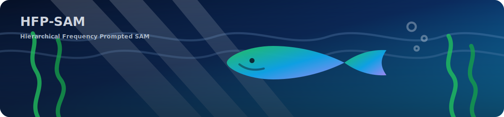
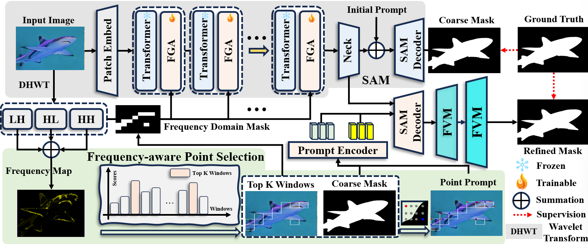

<div align="center">
  <p>
    
  </p>
  <h2>HFP-SAM: Hierarchical Frequency Prompted SAM for Efficient Marine Animal Segmentation</h2>
  <p>
    <a href="tipcode/train_y.py">Training script</a> ·
    <a href="tipcode/download_sam_ckpt.sh">Download SAM weights</a>
  </p>
  <p>
    
    
    
  </p>
</div>

## Introduction
This repository provides the experimental code for **HFP-SAM: Hierarchical Frequency Prompted SAM for Efficient Marine Animal Segmentation** (the GitHub release keeps only code and documentation closely related to the paper).

HFP-SAM targets **Marine Animal Segmentation (MAS)** and introduces:

- **FGA (Frequency Guided Adapter)**: uses frequency-domain prior masks to efficiently inject marine-scene information into a frozen SAM backbone
- **FPS (Frequency-aware Point Selection)**: selects highlighted regions via frequency analysis and fuses them with coarse segmentation to produce point prompts
- **FVM (Full-View Mamba)**: extracts spatial and channel contextual information with linear computational complexity

> Note: **datasets and large model weights are not included** in this repository by default (to avoid size/licensing issues). A download script and the expected dataset format are provided.

## Method Overview

<p align="center">
  
</p>
<p align="center"><i>Framework figure from the paper (FGA + FPS + FVM).</i></p>

## Paper & Materials
This repository **does not include** paper source files / response letters / review materials (code only). For the paper or supplementary materials, please use official publication channels or contact the authors.

## Repository Structure

```text
TIP-HFP-SAM/
  tipcode/               # training / inference code (main implementation)
  requirements.txt       # Python deps (install torch/torchvision via PyTorch official guide)
  LICENSE                # Apache-2.0
  CITATION.cff           # citation metadata
```

## Environment Setup

```bash
python3 -m venv .venv
source .venv/bin/activate
pip install -U pip
pip install -r requirements.txt
```

> We recommend installing `torch/torchvision` following the official PyTorch instructions to match your CUDA / platform.

## Optional: FVM/Mamba Acceleration Dependency
The FVM/Mamba path in `tipcode/segment_anything/modeling/vmamba.py` depends on the CUDA extension `selective_scan_cuda_core`.
If the extension is not available, the code will **automatically fall back** to a `DWConv+PWConv` approximation to remain runnable (**results will differ from the paper**).

## Prepare SAM pretrained checkpoint (required)
The SAM `vit_b` checkpoint (~375MB) is ignored by `.gitignore`. Please download it into `tipcode/`:

```bash
bash tipcode/download_sam_ckpt.sh
```

This will create: `tipcode/sam_vit_b_01ec64.pth`

## Data Preparation
`tipcode/dataset_fre.py` expects the following structure (file stems must match):

```text
<data_root>/
  Image/          xxx.jpg
  Masks/          xxx.png        # single-channel mask (0/255)
  Frequency_2/    xxx.jpg        # single-channel frequency prior (0~255)
```

## Training

```bash
python3 tipcode/train_y.py \
  --data_root <data_root> \
  --sam_ckpt tipcode/sam_vit_b_01ec64.pth \
  --save_dir checkpoint \
  --epochs 48 \
  --batch_size 6
```

Training checkpoints (`.pth`) will be saved to `--save_dir` and ignored by `.gitignore`.

## Inference / Testing (example)
An example testing script is provided (adjust paths for your dataset):

```bash
python3 tipcode/test.py \
  --checkpoint checkpoint/xxx.pth \
  --test_image_path <test_root>/image/ \
  --test_gt_path <test_root>/masks/ \
  --test_fre_path <test_root>/Frequency_2/ \
  --save_path outputs/pred_masks
```

## Citation
`CITATION.cff` is included (auto-detected by GitHub).

## Acknowledgements
- This project includes and modifies Meta's **Segment Anything** code (Apache-2.0). Please obtain SAM weights from official sources.

